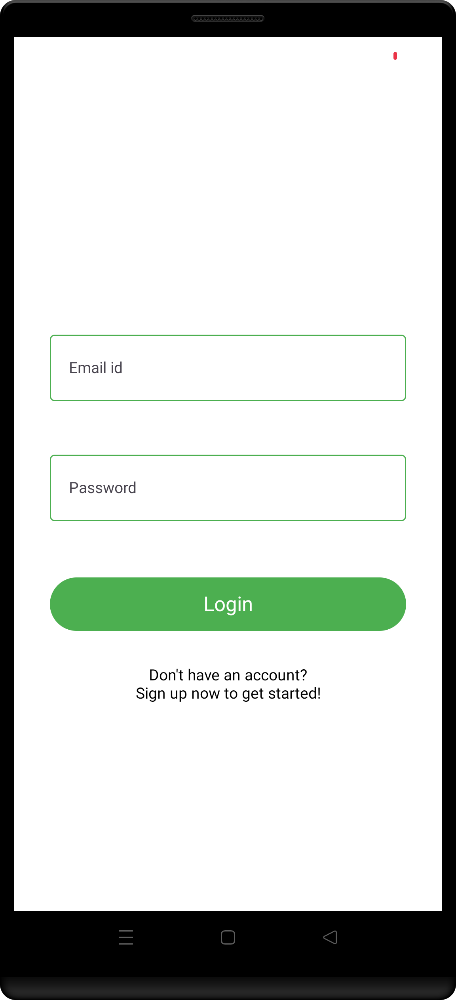
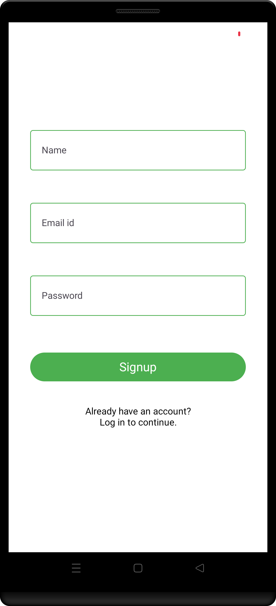
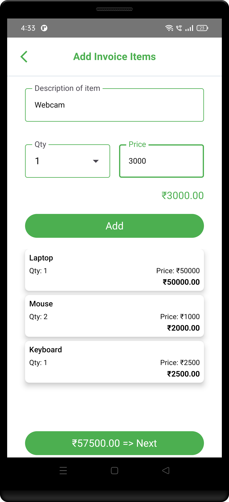
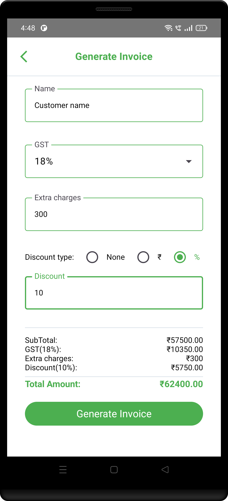
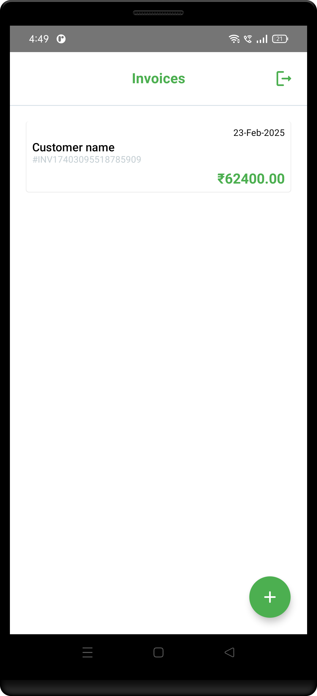
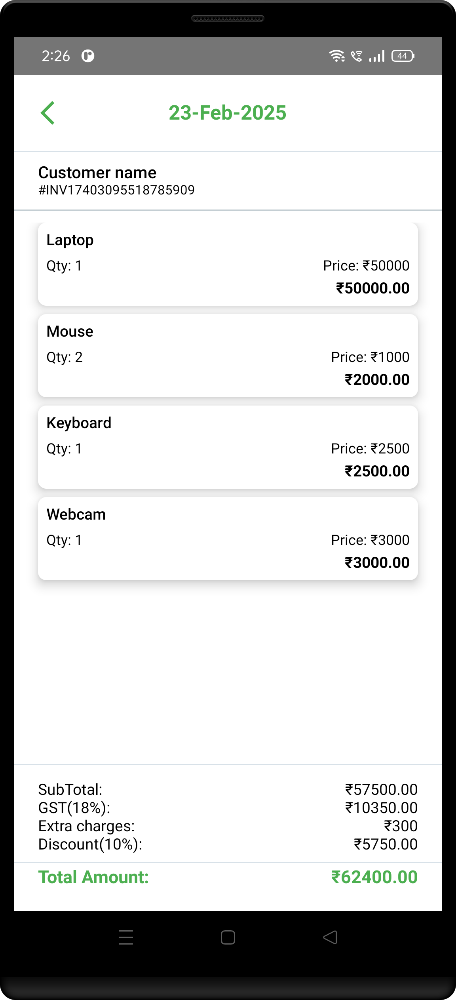

# Simple Invoice App

A simple Android application for managing invoices. Built using Jetpack Compose, Room Database, and Dagger-Hilt.

## Features

- **User Authentication**: Register and log in to your account.
- **Invoice Management**: Create, view, and manage invoices.
- **Modern UI**: Developed using Jetpack Compose for a seamless user experience.

## Screenshots

### 1. Login and SignUp

  
  

### 2. Add Invoice Items and Generate Invoice

  
  

### 3. Invoices and Invoice Details

  
  

